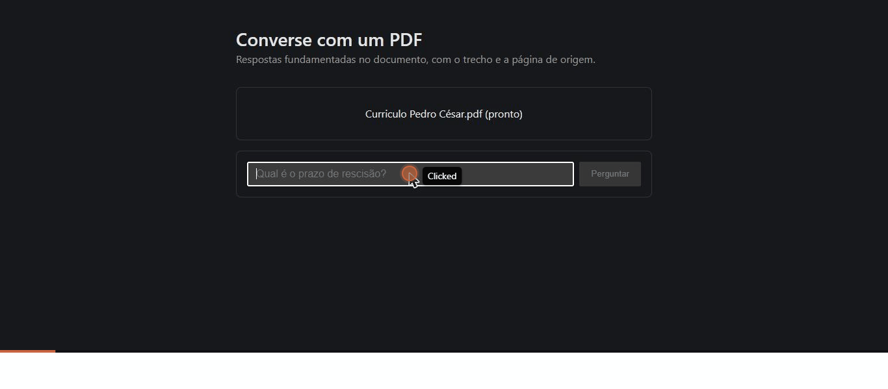

# Lastro

Converse com um PDF: respostas fundamentadas no documento, sempre com a página de origem.



O nome não é ornamental: *lastro* é aquilo que dá sustentação e garantia — exatamente o que
diferencia este sistema de um chatbot qualquer. Toda resposta é ancorada num trecho verificável do
documento, e o usuário vê qual.

O usuário sobe um PDF e pergunta sobre o conteúdo dele em linguagem natural. O sistema busca por
significado (não por palavra igual), monta um prompt com os trechos relevantes, e a LLM responde
citando o trecho e a página que fundamentaram a resposta. Nada é treinado: o conhecimento vive no
banco de dados, não no modelo.

**O sistema admite quando não sabe.** Se a pergunta não tem resposta no documento, a instrução no
prompt (grounding) manda dizer isso em vez de inventar — "não encontrei isso no documento" é uma
resposta correta, não uma falha. É a característica que diferencia um RAG confiável de um gerador
de plausibilidades.

Documentação completa, por etapas — o raciocínio por trás de cada decisão: `docs/documentacao.md`.

## Como rodar

**Pré-requisitos**, os dois rodando local, sem chave de API nenhuma (ver "Decisões de arquitetura"):

1. [Docker Desktop](https://www.docker.com/products/docker-desktop/) instalado e **aberto** — espere
   o ícone da baleia ficar estável na bandeja do sistema antes do próximo passo.
2. [Ollama](https://ollama.com) instalado e rodando, com o modelo de geração baixado:
   ```
   ollama pull llama3.1:8b
   ```

Com os dois de pé, na raiz do projeto:

```
docker compose up --build
```

Abra **http://localhost:8000**.

O primeiro `docker compose up` demora mais — builda a imagem, baixa a imagem do Postgres com
pgvector, e a aplicação baixa o modelo de embedding (~1 GB) na primeira vez que processa um
documento. As próximas subidas são rápidas (o cache do build e o modelo já baixado ficam salvos
em volumes).

**Usando a interface:**

1. Clique em "Escolher PDF" e suba um PDF com texto de verdade (não escaneado) — **sem precisar de
   conta**. Espere o status virar "pronto"; a indexação é síncrona (ver "Decisões de arquitetura"),
   então a tela fica esperando até terminar.
2. Digite uma pergunta e clique "Perguntar". **Só agora** aparece a tela de cadastro/login —
   cadastro adiado, ver "Decisões de arquitetura". Crie a conta (ou entre, se já tiver uma) e a
   pergunta que você já tinha digitado é enviada sozinha, sem precisar redigitar.
3. A resposta aparece com as citações (trecho + página) logo abaixo. O documento que você subiu
   antes de se cadastrar continua acessível na sua conta — é a adoção da sessão anônima, e tem
   teste de ponta a ponta próprio.

Perguntas muito genéricas ("do que se trata isto?") tendem a ficar longe de qualquer trecho no
espaço vetorial e disparam o "não encontrei" — pergunte algo específico que esteja no texto.

**Para parar:** `Ctrl+C` no terminal onde rodou `docker compose up`, ou `docker compose down` em
outra janela.

## Decisões de arquitetura

Cada linha abaixo é uma escolha que vale defender numa entrevista — o porquê importa mais que a
escolha em si. O raciocínio completo de cada uma está em `docs/documentacao.md`.

| Decisão | Por quê |
|---|---|
| **PostgreSQL + pgvector**, não Pinecone/Chroma | O projeto já usa Postgres; pgvector o transforma em banco vetorial. Uma peça de infraestrutura a menos, sem depender de serviço pago — e o Postgres já faz busca por palavra-chave nativamente, o que deixa a busca híbrida do roadmap acessível sem nada novo (Etapa 1) |
| **Sem LangChain nem LlamaIndex** | Esses frameworks entregam um RAG funcionando em uma tarde escondendo exatamente as partes que este projeto existe para demonstrar: divisão do texto, busca e montagem do prompt (Etapa 1) |
| **Corte recursivo por separadores**, não tamanho fixo | Cortar por parágrafo/frase respeita fronteiras de significado; tamanho fixo cego corta no meio de uma ideia. Custa umas vinte linhas a mais e vale a pena (Etapa 3) |
| **Chunk nunca atravessa página** | Página não ambígua, citação exata, código simples — em troca de, ocasionalmente, mutilar um parágrafo que atravessa a virada de página (Etapa 3) |
| **Tamanho do chunk (~450 caracteres)** | Ajustado para caber no teto de 128 tokens do modelo de embedding local — acima disso, o modelo trunca em silêncio. Descoberto testando, não no chute original de ~1600 (Etapa 3/4) |
| **Embedding local** (sentence-transformers, multilíngue) | Grátis, roda offline, e o documento não sai da máquina — mesma tese do outro projeto do portfólio (SecureFlow), aplicada aqui à vetorização (Etapa 4) |
| **Busca simples no v1**, híbrida no roadmap | A busca semântica erra código, nome próprio e número exato (captura sentido, não símbolo). A correção — busca híbrida com `tsvector` — é uma melhoria da busca simples: precisa que a simples exista e funcione antes de ter o que aprimorar (Etapa 5) |
| **k (~5) e limiar de distância (~0.65) calibrados, não chutados às cegas** | Medi a distância de cosseno real deste modelo em pares pergunta/chunk conhecidos (sinônimo relacionado ≈ 0.52, assunto ausente ≈ 0.96) antes de escolher o valor. Ainda não é o ideal medido por evals — é o ponto de partida honesto (Etapa 5) |
| **LLM local via Ollama**, não API paga | Revisão em relação ao plano original (que começava pela API): rodar local evita exigir chave de API ou cartão de crédito de quem clona o projeto para avaliar — o mesmo princípio de privacidade do embedding, agora também na geração (Etapa 6) |
| **Grounding + limiar = "não sei" como resposta válida** | Dois freios em etapas diferentes: o limiar da Etapa 5 impede contexto irrelevante de chegar à LLM; a instrução da Etapa 6 manda admitir quando a resposta não está no contexto. Um RAG que diz "não encontrei" está funcionando — a alternativa (inventar) é o único resultado inaceitável (Etapas 5 e 6) |
| **Indexação síncrona**, fila assíncrona no roadmap | Fila (Celery/ARQ + Redis) é o padrão de produção, mas é uma peça de infraestrutura inteira que não ensina nada sobre RAG. O teto de 20 MB do upload mantém o tempo síncrono aceitável no v1 (Etapa 7) |
| **Ollama roda no host, fora do `docker-compose.yml`** | É um runtime pesado (modelo de alguns GB) que faz mais sentido como pré-requisito instalado uma vez do que reconstruído a cada `docker compose up`. O app o alcança via `host.docker.internal` — os dois serviços do compose continuam sendo só aplicação e banco (Etapa 7) |
| **Cadastro adiado: conta exigida só na primeira pergunta**, não no upload | Pedir cadastro antes do usuário ver qualquer valor é a forma mais eficiente de perdê-lo. Adiar a barreira transforma o cadastro em preservação do documento já processado, não em pedágio (Etapa 1, seção 1.5) |
| **Sessão anônima com adoção no cadastro/login** | Entre o upload e a conta, o documento pertence a um token de sessão anônima. Cadastro e login transferem esses documentos para o usuário — na mesma transação da criação da conta, para nunca cadastrar sem entregar o que motivou o cadastro (Etapa 7, seção 7.3) |
| **Interface mínima**: upload, pergunta, resposta, citação, cadastro/login — nada além disso | Histórico de conversas, múltiplos documentos e tema escuro são polimento que não demonstra o núcleo. A citação é o único capricho aceito: é o que fecha o ciclo de confiança (Etapas 6 e 7) |

## Limitações conhecidas (v1) e roadmap

Declaradas de propósito — todo sistema real tem limitações; a diferença é conhecê-las. O roadmap
não é dívida técnica: é a prova de que o caminho de produção inteiro foi mapeado, e o v1 parou
onde parou por escolha, não por não saber o que vem depois.

| Limitação do v1 | Correção no roadmap |
|---|---|
| Apenas PDF, um documento por vez | DOCX e múltiplos documentos por coleção |
| PDF escaneado não é aceito (sem camada de texto) | OCR |
| Texto em duas colunas pode sair embaralhado; tabelas viram texto corrido | PDF não garante ordem de leitura nem guarda estrutura de tabela — sem correção simples no roadmap atual |
| Busca só semântica — erra código, nome próprio, número exato | Busca híbrida (semântica + `tsvector`), o item mais valioso do roadmap |
| Resultados sem reordenação por relevância fina | Reranking |
| k e limiar são chutes calibrados, não medidos | Suíte formal de evals |
| Indexação síncrona (upload grande demora a requisição inteira) | Fila assíncrona (Celery/ARQ + Redis) |
| Resposta aparece pronta, não token a token | Streaming (SSE) |
| Documentos não podem ser compartilhados entre usuários — o v1 isola por dono | Compartilhamento com permissões |
| Documento sai para a LLM local, mas nada impede dado pessoal nele | Anonimização antes do envio — a integração natural com o SecureFlow, o outro projeto do portfólio |

## Stack

| Camada | Tecnologia |
|---|---|
| Linguagem | Python 3.11+ |
| API | FastAPI + Uvicorn |
| Validação | Pydantic |
| Extração de PDF | PyMuPDF |
| Embeddings | sentence-transformers (local, multilíngue) |
| LLM (geração) | Ollama, local (Llama 3.1 8B) |
| Banco | PostgreSQL + pgvector |
| Frontend | TypeScript + React (Vite) |
| Testes | pytest |
| Empacotamento | Docker Compose |

## Estrutura

```
app/
├── main.py                 # FastAPI: rotas do núcleo + rotas de conta (seção 7.2)
├── pipeline.py              # orquestra as etapas e a regra de acesso (eh_dono) — sem lógica de RAG em main.py
├── config.py                # configuração via variável de ambiente
├── modelos.py                # schemas Pydantic (contratos da API)
├── auth/                      # Etapa 7 — cadastro adiado (seção 1.5) e adoção de sessão (seção 7.3)
│   ├── seguranca.py            # hash de senha e token — sem tocar no banco
│   └── armazenador.py          # tabela usuarios + adoção de documentos
├── ingestao/                 # Etapa 2
│   ├── upload.py             # validação e guarda do arquivo
│   └── extrator.py           # PDF → texto, página por página
├── chunking/                  # Etapa 3
│   └── divisor.py              # texto → chunks, por corte recursivo
├── indexacao/                  # Etapa 4
│   ├── embedder.py              # texto → vetor (modelo local)
│   └── armazenador.py           # grava documentos (com dono) + chunks + vetores no PostgreSQL
├── recuperacao/                 # Etapa 5
│   └── buscador.py               # pergunta → chunks mais relevantes
└── geracao/                     # Etapa 6
    ├── prompt.py                  # instrução + contexto + pergunta
    ├── llm.py                     # chamada isolada ao modelo local (gerar(prompt) -> texto)
    └── responder.py               # monta prompt + chama a LLM
frontend/                    # Etapa 7 — interface mínima (React + TypeScript + Vite)
│   └── src/Auth.tsx           # tela de cadastro/login, disparada no 401 de POST /perguntas
tests/
├── fixtures/                # PDFs de teste
├── conftest.py              # fixtures compartilhadas (Postgres real)
├── test_ingestao.py
├── test_chunking.py
├── test_embedder.py
├── test_armazenador.py
├── test_buscador.py
├── test_buscador_unitario.py
├── test_auth_seguranca.py
├── test_auth_armazenador.py
├── test_pipeline.py           # eh_dono() — a regra de acesso
├── test_prompt.py
├── test_responder.py
└── test_e2e.py               # Etapa 7 — pipeline inteiro via API real, incluindo a adoção de sessão
docker-compose.yml          # app + Postgres com pgvector
Dockerfile                  # build do frontend + imagem da aplicação
```

## Rodando sem Docker (desenvolvimento)

```
python -m venv .venv
.venv\Scripts\activate
pip install -r requirements.txt
cp .env.example .env   # ajuste DATABASE_URL e SECRET_KEY

ollama pull llama3.1:8b

pytest tests/
```

O primeiro `pytest` baixa o modelo de embedding (~1 GB, uma vez só — fica em cache local). Os
testes de integração (`test_armazenador.py`, `test_auth_armazenador.py`, `test_buscador.py`,
`test_e2e.py`) só rodam se `DATABASE_URL` apontar para um Postgres com a extensão `vector` já
instalada; caso contrário, pulam automaticamente — no Windows sem Docker, pgvector não tem
binário pronto e exigiria compilar com Visual Studio Build Tools, então o caminho recomendado ali
é o Docker mesmo. Nenhum teste chama o Ollama de verdade fora de `test_e2e.py`: `llm.gerar()` é
substituído por um dublê (mock) no resto da suíte.

Para rodar a API sozinha (sem o frontend buildado):

```
uvicorn app.main:app --reload
```
